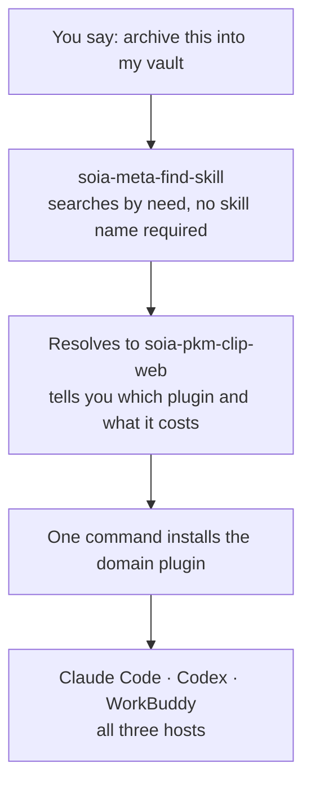

<div align="center">


# SOIA Skills

**The hard part isn't learning a skill — it's remembering which one to call**

74 public skills, 8 domains, one entry point. Describe the goal; you don't have to memorize the catalog

[中文](README.md) · English

</div>

---

## What it solves

Once a skill library gets large, the real cost is not learning any single skill — it's **remembering which ones exist**. This repo is the ecosystem portal: specifications, cross-repo navigation, the marketplace manifest, and 4 meta skills that manage the ecosystem itself.



## 8 domain plugins

Install a domain and get every skill in it. **Always-on** is the context the skill index consumes each session; bodies load only when a skill fires.

| Domain plugin | What it does | Skills | Always-on |
|---|---|---:|---:|
| [`soia-pkm-vault`](https://github.com/soia-team/soia-open-pkm-vault-skills) | Vault: capture, organize, distill, transform | 26 | ~2.8k |
| [`soia-env`](https://github.com/soia-team/soia-open-env-skills) | Environment: AI CLI installs, network diagnosis, disk hygiene | 15 | ~1.5k |
| [`soia-dev`](https://github.com/soia-team/soia-open-dev-skills) | Development: change loop, testing, release, repo ops | 12 | ~971 |
| [`soia-media-content`](https://github.com/soia-team/soia-open-media-content-skills) | Content: drafting, imagery, per-platform adaptation | 6 | ~728 |
| [`soia-dev-design`](https://github.com/soia-team/soia-open-dev-design-skills) | Design: PRDs, prototypes, diagrams, Office | 6 | ~548 |
| **`soia-meta`** (this repo) | Ecosystem: search, sync, release, prompts | 4 | ~428 |
| [`soia-cwork-office`](https://github.com/soia-team/soia-open-cwork-office-skills) | Collaboration: Feishu and ProcessOn material to local files | 3 | ~309 |
| [`soia-edu-course`](https://github.com/soia-team/soia-open-edu-course-skills) | Courses: outlines and lesson plans | 2 | ~140 |

> `claude plugin disable <plugin>@soia` on a domain you are not using drops it to zero; enable it again any time.

## Start here

Two commands, then say "**find me a skill**":

```bash
claude plugin marketplace add soia-team/soia-open-skills && claude plugin install soia-meta@soia
```

```bash
codex plugin marketplace add soia-team/soia-open-skills && codex plugin add soia-meta@soia
```

WorkBuddy is a desktop app with no CLI, so a skill does the work — tell your agent "install into WorkBuddy", or run:

```bash
python3 skills/soia-meta-skill-release/scripts/install_workbuddy_experts.py
```

With no arguments it installs all 12 experts; pass plugin names to pick. Restart the client, then summon under Experts → My Experts — this repo's expert is **Soia · 技能生态管家**.

## 4 meta skills

### 01 Ecosystem management　`One sentence of need → found, installed, synced, released`

| Skill | Responsibility | Ready |
|---|---|:-:|
| [`soia-meta-find-skill`](https://github.com/soia-team/soia-open-skills/blob/main/docs/skills/soia-meta-find-skill.md) | Searches the whole ecosystem by need and loads the right skill — no need to know its name | ✅ |
| [`soia-meta-sync-skills`](https://github.com/soia-team/soia-open-skills/blob/main/docs/skills/soia-meta-sync-skills.md) | Symlinks a skill source into the AI tool directories you explicitly choose | ✅ |
| [`soia-meta-skill-release`](https://github.com/soia-team/soia-open-skills/blob/main/docs/skills/soia-meta-skill-release.md) | After a merge: marketplace publish, client update, WorkBuddy expert install, cache reclamation | ✅ |
| [`soia-meta-prompt-clarity`](https://github.com/soia-team/soia-open-skills/blob/main/docs/skills/soia-meta-prompt-clarity.md) | Drafts, diagnoses and specifies prompts in Chinese or English, preserving intent and safety boundaries | ✅ |

✅ All four work right after install

## Three hosts, one set of skills

A domain repo is simultaneously a plugin for all three — skills are never copied, and the icon is literally the same file:

| Host | Unit of loading | Toggle |
|---|---|---|
| Claude Code | Domain plugin | `plugin enable/disable`, zero context cost |
| Codex | Domain plugin | Marketplace-level enable |
| WorkBuddy | **Role-based expert** (12 of them) | Summon / switch expert; not in context until summoned |

## What it does not do

- **Not an AI client.** It extends the Claude Code / Codex you already use rather than replacing them.
- **Does not host your data.** Everything stays on your machine; the skills only supply the method.
- **Does not store credentials.** Platform sessions stay in their official flows — never in the repo or logs.
- **No internal company process.** Industry-specific requirement, test and release standards are out of scope for this open-source ecosystem.

## Documentation

| Document | Covers |
|---|---|
| [docs/learning-guide.en.md](docs/learning-guide.en.md) | **Start here**: how the ecosystem works, why it is designed this way, FAQs |
| [docs/skills/](docs/skills/README.md) | **Per-skill pages for all 74 skills**: triggers, outputs, usage examples, install |
| [docs/install/](docs/install/README.en.md) | Install guides for 60+ AI hosts |
| [docs/install-profiles.md](docs/install-profiles.md) | Setups organized by machine purpose |
| [SKILL_SPEC.md](SKILL_SPEC.md) | Skill structure, naming, frontmatter, validation |
| [DATA_STORAGE_SPEC.md](DATA_STORAGE_SPEC.md) | Boundaries for config, credentials, state, cache, output |
| [CONTRIBUTING.md](CONTRIBUTING.md) | Contributor guide plus the maintainer handbook |
| [routing/routing-manifest.json](routing/routing-manifest.json) | Machine-readable catalog of every skill |

## Contributing

Before committing a skill change:

```bash
python3 -m unittest discover -s tests -p 'test_*.py' && python3 scripts/audit_skills.py --strict && python3 scripts/generate_expert_manifest.py --check
```

Full workflow in [CONTRIBUTING.md](CONTRIBUTING.md).

## License

MIT — see [LICENSE](./LICENSE).
