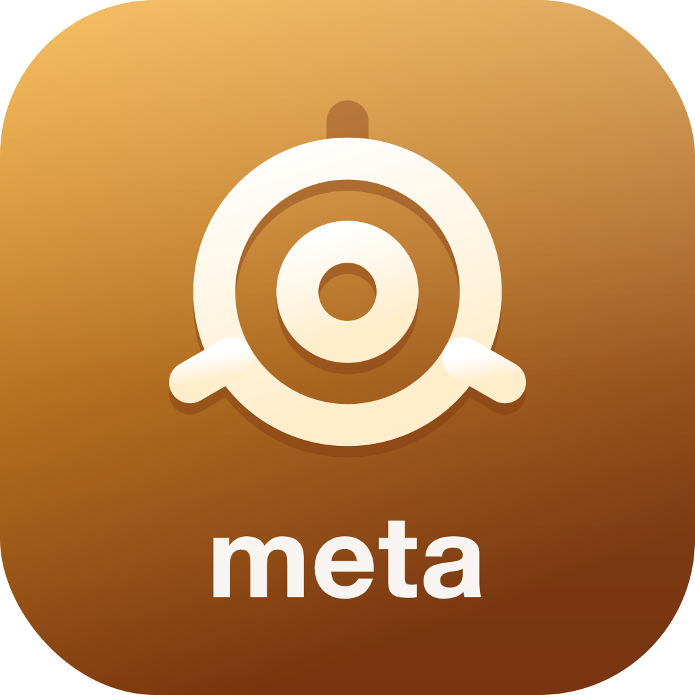
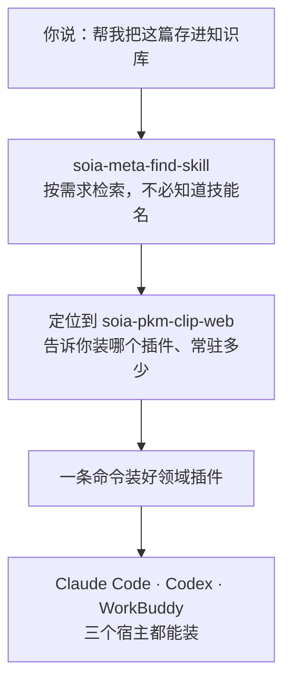

<div align="center">



# SOIA Skills

**技能越来越多，最麻烦的不是「不会用」，而是不知道该叫谁**

74 个公开技能，8 个领域，一个入口；描述目标即可，不必先背完目录

[English](README.en.md) · 中文

<p align="center">
  
  
  
  
  
</p>

</div>

---

## 它解决什么

技能库大了以后，真正的成本不是学会用某个技能，而是**记住有哪些**。本仓是生态门户：规范真源、跨仓导航、市场清单，以及 4 个管理生态自身的 meta 技能。



## 8 个领域插件

装整个领域，一次拿到该域全部技能。**常驻成本**指技能索引每次会话占用的上下文，正文只在命中时载入。

| 领域插件 | 做什么 | 技能 | 常驻 |
|---|---|---:|---:|
| [`soia-pkm-vault`](https://github.com/soia-team/soia-open-pkm-vault-skills) | 知识库：采集、整理、提炼、转换 | 26 | ~2.8k |
| [`soia-env`](https://github.com/soia-team/soia-open-env-skills) | 环境：AI CLI 安装、网络诊断、空间治理 | 15 | ~1.5k |
| [`soia-dev`](https://github.com/soia-team/soia-open-dev-skills) | 开发：改动闭环、测试、发版、仓库运维 | 12 | ~971 |
| [`soia-media-content`](https://github.com/soia-team/soia-open-media-content-skills) | 内容：成文、配图、多平台改写 | 6 | ~728 |
| [`soia-dev-design`](https://github.com/soia-team/soia-open-dev-design-skills) | 设计：PRD、原型、架构图、Office | 6 | ~548 |
| **`soia-meta`**（本仓） | 生态：检索、同步、发布、提示词 | 4 | ~428 |
| [`soia-cwork-office`](https://github.com/soia-team/soia-open-cwork-office-skills) | 协作：飞书与 ProcessOn 资料落本地 | 3 | ~309 |
| [`soia-edu-course`](https://github.com/soia-team/soia-open-edu-course-skills) | 课程：大纲与教案设计 | 2 | ~140 |

> 暂时不用的域 `claude plugin disable <插件名>@soia`，成本归零，随时开回来。

## 从这里开始

两条命令，然后说「**找个技能**」：

```bash
claude plugin marketplace add soia-team/soia-open-skills && claude plugin install soia-meta@soia
```

```bash
codex plugin marketplace add soia-team/soia-open-skills && codex plugin add soia-meta@soia
```

WorkBuddy 是桌面端没有 CLI，由技能代劳——对 AI 说「装到 WorkBuddy」，或直接跑：

```bash
python3 skills/soia-meta-skill-release/scripts/install_workbuddy_experts.py
```

不带参数装全部 12 个专家，也可只给要装的插件名。装完重启客户端，在【专家中心 → 我的专家】召唤——本仓对应的是 **Soia · 技能生态管家**。

## 4 个 meta 技能

### 01 生态管理　`一句需求 → 找到、装上、同步、发布`

| 技能 | 职责 | 开箱 |
|---|---|:-:|
| [`soia-meta-find-skill`](https://github.com/soia-team/soia-open-skills/blob/main/docs/skills/soia-meta-find-skill.md) | 按需求检索全生态技能并加载，不必预先知道技能名 | ✅ |
| [`soia-meta-sync-skills`](https://github.com/soia-team/soia-open-skills/blob/main/docs/skills/soia-meta-sync-skills.md) | 把技能源软链同步到你明确选择的 AI 工具目录 | ✅ |
| [`soia-meta-skill-release`](https://github.com/soia-team/soia-open-skills/blob/main/docs/skills/soia-meta-skill-release.md) | 改动合并后完成市场发布、客户端更新、WorkBuddy 专家安装与缓存回收 | ✅ |
| [`soia-meta-publish-market`](https://github.com/soia-team/soia-open-skills/blob/main/docs/skills/soia-meta-publish-market.md) | 把已发版技能上架到腾讯 SkillHub 与小红书 Red Skill：筛选、打包、预检 | ✅ |
| [`soia-meta-prompt-clarity`](https://github.com/soia-team/soia-open-skills/blob/main/docs/skills/soia-meta-prompt-clarity.md) | 起草、诊断并规格化中英文提示词，保留原意与安全边界 | ✅ |

✅ 五个技能装完即用

## 三个宿主，同一套技能

一个域仓同时是三家的插件——技能不复制，图标也是同一个文件：

| 宿主 | 装载单位 | 开关 |
|---|---|---|
| Claude Code | 域插件 | `plugin enable/disable`，上下文零成本 |
| Codex | 域插件 | 市场级 enable |
| WorkBuddy | **角色化专家**（12 个） | 召唤/切换专家，不召唤就不在场 |

## 不负责什么

- **不是 AI 客户端**。它扩展你已有的 Claude Code / Codex，不替代它们。
- **不托管你的数据**。所有内容留在你自己的机器上，技能只提供操作方法。
- **不保存凭据**。各平台登录态由官方流程持有，不进仓库、不进日志。
- **不含公司内部流程**。行业特定的需求、测试、发版规范不在本生态开源范围内。

## 文档

| 文档 | 说明 |
|---|---|
| [docs/learning-guide.md](docs/learning-guide.md) | **先读这份**：整套生态怎么运转、为什么这么设计、常见疑问 |
| [docs/skills/](docs/skills/README.md) | **74 个技能逐个详情页**：触发词、产物、用法示例与安装 |
| [docs/install/](docs/install/README.md) | 60+ AI 宿主的安装指南 |
| [docs/install-profiles.md](docs/install-profiles.md) | 按机器用途组织的安装组合 |
| [SKILL_SPEC.md](SKILL_SPEC.md) | 技能结构、命名、frontmatter 与验证要求 |
| [DATA_STORAGE_SPEC.md](DATA_STORAGE_SPEC.md) | 配置、凭据、状态、缓存与输出的存储边界 |
| [CONTRIBUTING.md](CONTRIBUTING.md) | 外部贡献者指南 + 维护者手册 |
| [routing/routing-manifest.json](routing/routing-manifest.json) | 机器可读的全生态技能目录 |

## 贡献

改动技能后提交前跑：

```bash
python3 -m unittest discover -s tests -p 'test_*.py' && python3 scripts/audit_skills.py --strict && python3 scripts/generate_expert_manifest.py --check
```

完整流程见 [CONTRIBUTING.md](CONTRIBUTING.md)。

## License

MIT —— 见 [LICENSE](./LICENSE)。
