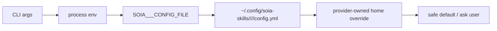

# Skill Authoring Spec

This repository publishes reusable agent skills. Every skill must work for users who do not share the maintainer's vault layout, shell profile, accounts, family context, or private files.

## Public Skill Rules

### 0. Start from the template

Create new skills from the repository template:

```bash
cp -R templates/skill-template skills/<your-skill-name>
mv skills/<your-skill-name>/SKILL.md.template skills/<your-skill-name>/SKILL.md
python3 scripts/generate_skill_catalog.py
python3 scripts/audit_skills.py
```

The template is intentionally generic: it shows config discovery, provider setup boundaries, and validation language without encoding any maintainer-specific vault layout.

`soia-open-skills` and `soia-private-skills` intentionally use the same template
path and outer structure:

```text
templates/skill-template/
├── SKILL.md.template
├── agents/openai.yaml
├── assets/
├── references/
└── scripts/
```

Do not rename this directory to `open-skill-template`. The repository name
already scopes the public/private difference, while a shared template path keeps
agent instructions and contributor commands consistent.

### 0.5 Common skill design principles

The public and private repositories share the same authoring principles. Only
distribution, privacy, and release acceptance differ.

- **Progressive disclosure:** frontmatter is trigger metadata, the first screen
  explains the customer workflow, and the main `SKILL.md` keeps only stable
  instructions. Variant-specific details belong in `references/`, linked from
  the main file with no more than one additional hop. Keep the main file under
  500 lines whenever practical; split it when it becomes a reference manual.
- **Freedom follows risk:** leave room for judgment in low-risk analysis, use
  explicit parameters for configurable workflows, and constrain fragile or
  destructive actions with previews, dry-runs, allowlists, and confirmation.
  Deletion, overwrite, send, publish, and remote-state changes need an explicit
  safety boundary.
- **Validation has evidence:** define the acceptance evidence before execution.
  Distinguish static checks from fixture/forward tests and end-to-end checks;
  claim only the checks that actually ran. Complex skills with scripts,
  external APIs, or generated artifacts should have at least one realistic
  forward test that verifies the output, not only the exit code.
- **One source of truth:** keep mutable mappings and provider facts in a
  machine-readable reference or config, and make prose link to it. Do not copy
  the same list into several files.
- **No documentation clutter:** required workflow stays in `SKILL.md`; do not
  add per-skill `README`, install guide, changelog, quick reference, or
  architecture files. Use `references/` for durable supporting material.
- **Portable language:** write instructions in imperative/infinitive form,
  explain the customer's next action, and never rely on maintainer paths,
  accounts, secrets, or private context.

Recommended authoring loop: identify concrete triggers and outputs → decide the
resource layout → implement the smallest reliable workflow → run static and
realistic output checks → attack the riskiest assumption → trim duplicated or
nonessential instructions.

### Customer-readable `SKILL.md` contract

Every skill must make its first screen understandable to a customer, not only to
the maintainer. Near the top of `SKILL.md`, include a customer-readable section
that answers:

- What this skill can do.
- How the customer should use it and what inputs they must provide.
- Hard dependencies, optional dependencies, third-party skill relationships, and
  installation/setup steps.
- Where skill-specific private config belongs, using
  `~/.config/soia-skills/<repo>/<skill-type>/<skill-name>/config.yml` and
  `SOIA_<TYPE>_<SHORT>_CONFIG_FILE` when relevant.
- What logs, file changes, validation evidence, issues, and next steps the
  customer will see after every run.

Required customer-facing markers:

- `客户可读说明` or an equivalent customer-visible introduction.
- `这个技能可以做什么` / `能做什么`.
- `客户如何使用` / `如何使用` / `如何运行`.
- `依赖与安装` / `首次安装与配置` / explicit dependency section.
- `日志与完成回执` / `客户可见日志与总结` / completion receipt.

Required workflow instructions must still live in `SKILL.md`; do not hide them in
`agents/openai.yaml`, README files, or private notes.

### Machine-readable dependencies (frontmatter)

Skills with install-level relationships must declare them machine-readably in
`SKILL.md` frontmatter, in addition to the prose `依赖与安装` section:

```yaml
dependencies:
  hard: [soia-pkm-alipan-drive-ops]          # cannot run without; sync tools auto-include
  optional: [soia-pkm-organize-article-moc]    # enhances, degrades gracefully; never auto-installed
  external:                        # skills outside the SOIA repos; declare install only
    - name: weread-skills
      required: true               # true = core workflows stop without it
      install: "npx skills add Tencent/WeChatReading -g -y"
```

Rules:

- `hard` / `optional` list SOIA-managed skill names only (published from
  soia-open-skills or soia-private-skills).
- `hard` means the core workflow cannot complete without the dependency;
  `soia-dev-sync-skills` expands the transitive hard closure on single-skill
  sync and warns when a hard dependency is missing from the shared source.
- `optional` and `external` are never auto-installed: at runtime the agent
  detects the gap, degrades, and reminds the customer with the install command.
- Declare only real install-level dependencies. Pipeline neighbors,
  routing-table references, and prose mentions stay out of `dependencies`.

### Version and timestamps (frontmatter)

Every `SKILL.md` frontmatter should include version and timestamp fields:

```yaml
---
name: soia-pkm-transform-obsidian-pdf
description: ...
version: 1.0.0
created_at: 2026-07-16 10:58:46
updated_at: 2026-07-16 13:25:56
created_by: claude opus 4.6
updated_by: claude opus 4.6
---
```

Rules:

- `version`: semver (`MAJOR.MINOR.PATCH`). Bump MAJOR for breaking changes
  (renamed skill, changed input/output contract), MINOR for new capabilities,
  PATCH for bug fixes and reference updates.
- `created_at`: the datetime the skill was first committed. Never changes.
- `updated_at`: the datetime of the most recent substantive change to the
  skill (SKILL.md, scripts, or references). Update on every commit that
  touches this skill.
- `created_by`: the AI model that authored the skill. Never changes.
  Use the concrete model name, not the CLI product name: `claude opus 4.6`,
  `gpt-5.6-luna` are valid; `codex` / `codex 5.6` are not (codex is a CLI —
  record the model behind it, see `model` in `~/.codex/config.toml`).
- `updated_by`: the AI model that made the most recent substantive change.
  Update together with `updated_at`.
- All datetimes use `YYYY-MM-DD HH:mm:ss` format (24-hour, local time).
- New skills must include all five fields.

### Naming convention

Skill names use 4–5 kebab-case segments. Each segment has a fixed role:

```
soia-pkm-<action>-<object>[-<qualifier>]
```

| Segment | Role | Examples |
|---------|------|----------|
| `soia-pkm` | Org + domain prefix (fixed) | — |
| `<action>` | Pipeline stage: `clip`, `organize`, `distill`, `transform`, `compose`, `publish`, or support verbs (`maintain`, `bootstrap`) | `clip`, `transform` |
| `<object>` | What the skill operates on, or where it operates | `x`, `web`, `wechat`, `article`, `obsidian` |
| `<qualifier>` | (Optional) Output type or platform that disambiguates siblings | `pdf`, `slides`, `visual`, `notebooklm` |

How to pick `<object>` vs `<qualifier>`:

- **Input/source** goes in `<object>`: `clip-x` (source is X), `clip-web` (source
  is web).
- **Output type** goes in `<qualifier>` when there are multiple output-type
  siblings: `transform-article-slides`, `transform-article-visual`.
- **Platform/tool** goes in `<object>` or `<qualifier>` when the platform IS
  the defining trait: `transform-obsidian-pdf` (Obsidian is the knowledge base,
  PDF is the output), `transform-article-notebooklm` (NotebookLM is the
  platform).
- A 3-segment name (`soia-pkm-transform`) is too vague for Claude Code to
  disambiguate. **Minimum 4 segments for new skills.**

When naming, ask: "If a user says one sentence, which segment makes the match
unambiguous?" That segment must be in the name.

### 1. No hardcoded personal paths

Do not hardcode maintainer-specific or vault-specific paths in scripts, `SKILL.md`, examples, or config templates.

Forbidden examples:

```text
/Users/<name>/...
~/Desktop/<personal-folder>
<personal-vault-output-dir>
<personal-vault-articles-dir>
```

Use one of these instead:

```text
<vault-relative-output-dir>
outputs/transform
$OBSIDIAN_VAULT
--vault <path>
SOIA_PKM_TRANSFORM_CONFIG=/path/to/transform.yml
~/.config/soia-skills/soia-open-skills/soia-pkm/soia-pkm-transform/config.yml
```

Chinese or highly personal directory names are allowed only in a user's private config, never as public defaults.

### 2. No secrets or account material

Never commit real keys, tokens, cookies, session strings, usernames, passwords, private `config.yml`, or `.env` files.

Allowed public examples:

```text
WECHAT_APP_ID=<YOUR_APP_ID>
WEREAD_API_KEY=<YOUR_API_KEY>
notebooklm login
```

Forbidden public examples:

```text
WECHAT_APP_SECRET=real-secret-value
WEREAD_API_KEY=real-key
TELEGRAM_SESSION_STRING=real-session
```

Provider authentication must live in the provider's private auth flow or a user-owned config file outside this repo.

### 3. Keep personal context out of public skills

Do not include private family, children, home, finances, health, addresses, phone numbers, or private learning profiles in public skills, examples, or screenshots.

If a workflow needs user preferences, model it as config:

```yaml
audience_profiles:
  - name: learner-a
    age_band: primary_school
    interests: []
```

Do not publish real names, ages, grades, schools, or private performance data.

### 4. Configuration first, not code edits

If behavior differs by user, make it configurable. Do not change code or `SKILL.md` to encode one user's needs.

Use this order:

1. CLI argument
2. Environment variable
3. Skill-specific private `config.yml`
4. Provider-owned login/config directory when the provider requires it
5. Generic safe fallback

Config templates must be generic and safe. They may show placeholders but not personal defaults.

Default private config location:

```text
~/.config/soia-skills/soia-open-skills/<skill-type>/<skill-name>/config.yml
```

The file uses YAML with an `env:` mapping. Example:

```yaml
env:
  OBSIDIAN_VAULT: "<vault-path>"
  WEREAD_API_KEY: "<YOUR_API_KEY>"
```

Skill-specific override variables should be named `SOIA_<TYPE>_<SHORT>_CONFIG_FILE`.
The older `SOIA_<TYPE>_<SHORT>_ENV_FILE` spelling may be accepted as a compatibility alias,
but new docs should prefer `CONFIG_FILE`.

Provider-owned login state may live under the skill directory only when the skill explicitly
owns that provider home. Example: `soia-pkm-transform` may set `NOTEBOOKLM_HOME` to
`~/.config/soia-skills/soia-open-skills/soia-pkm/soia-pkm-transform/notebooklm`.
Other provider-owned stores such as `~/.config/aliyunpan/` stay with the provider; the
skill config may only hold override pointers such as `ALIYUNPAN_CONFIG_DIR`.



### Script disk-write destinations

Before a skill script writes any file to disk, classify it first — never default to a hardcoded cwd-relative path.

硬规则：脚本禁止硬编码 Unix-only 路径。必须使用语言内置的跨平台 API：Python 使用 `tempfile.gettempdir()` / `Path.home()`，Node 使用 `os.tmpdir()` / `os.homedir()`；路径拼接一律使用 `pathlib` / `path.join`。不得手写 `~` 展开、`/tmp`、XDG 路径或 Windows 反斜杠来代替这些 API。

三平台等价关系：

| 类别 | linux/macOS | Windows |
|---|---|---|
| A 临时 | `$TMPDIR` 或 `/tmp` | `%TEMP%`（由 `os.tmpdir()` / `tempfile` 自动处理） |
| B 审计 | `${XDG_STATE_HOME:-~/.local/state}/<skill>/` | `%LOCALAPPDATA%/<skill>/state/` |
| 私有 config | `~/.config/soia-skills/...` | `%APPDATA%/soia-skills/...` |
| C 交付物默认 | `~/Downloads/<skill>/` 或用户指定 | 同左（Downloads 三平台皆有） |

兼容说明：现有 skill 中的 Unix 写法逐步迁移；新脚本必须跨平台，不能新增 Unix-only 路径。

| Category | Nature | Destination |
|---|---|---|
| A. Disposable run output | Run reports / temporary intermediates, useful only right after this run | `${TMPDIR:-/tmp}/<skill-name>/`; consider `LOG_KEEP`-style rotation |
| B. Audit trail | Recorded deletions, publishes, syncs, or other system-state changes that must stay traceable | `${XDG_STATE_HOME:-~/.local/state}/<skill-name>/`, with rotation and an override hook |
| C. User deliverable | Translations, images, generated documents the user asked for | A user-specified path, or the product's documented convention |
| D. The product feature is the log | e.g. a session log that belongs in the vault | Whatever the product design says |
| E. Pure stdout | Nothing here is worth keeping past this run | Do not write to disk |

Test: does this file still have value after this run ends, and does it record a state change that cannot be replayed? A "yes" to either pushes it to at least category B. Resolve the destination from `$TMPDIR`, `$XDG_STATE_HOME`, an explicit CLI/config path, or the product's own design — not from `Path.cwd()` or a bare relative path.

### 5. Separate public examples from private examples

Public examples must be reusable and anonymized. If a maintainer validates with their own vault, do not copy those concrete paths or filenames into docs.

Good:

```text
转换文章为 PPT：<path-to-article.md>
归档并转成 PDF：<x-url>
```

Bad:

```text
转换 /Users/<name>/.../2026-07-07-X-real-title.md 为 PPT
```

### 6. Validate before claiming success

Use precise language:

- "static checks passed" means syntax / lint / `git diff --check` passed.
- "installed locally" means the skill was copied or linked to an agent skill directory.
- "end-to-end tested" means a realistic user request produced the requested artifact and validation checked that artifact.
- "committed" means `git commit` actually succeeded.

Do not say "tested" or "passed" without saying which checks ran.

### 7. Public skill checklist

Before commit, verify:

- [ ] `SKILL.md` has `name` and concise `description` with triggers.
- [ ] `SKILL.md` has a customer-readable intro covering capabilities, usage, dependencies/install, config, logs, and completion receipt.
- [ ] No `metadata.json`; public skills use `SKILL.md` and optional `agents/openai.yaml`.
- [ ] No maintainer-specific paths or vault directory names.
- [ ] No real secrets, cookies, tokens, sessions, private `config.yml`, or `.env` files.
- [ ] No private family/home/personal profile information.
- [ ] User-specific behavior is in config, not code.
- [ ] Examples use placeholders or generic paths.
- [ ] Scripts accept CLI args and/or env vars for paths.
- [ ] Root `README.md` and `README.en.md` describe new skills/domains, installation, configuration, and trigger examples; generated `skills/README.md` is refreshed.
- [ ] Machine-readable references have one source of truth and Markdown guides link to it instead of duplicating mutable lists.
- [ ] Main `SKILL.md` is concise (target: under 500 lines); complex skills have a realistic forward test or fixture-backed output check.
- [ ] Validation commands and limits are documented.
- [ ] `git diff --check` passes.

Run the repository audit:

```bash
python3 scripts/generate_skill_catalog.py --check
python3 scripts/audit_skills.py
```

Use `--strict` in CI or before release when WARN-level drift should block:

```bash
python3 scripts/audit_skills.py --strict
```

Suggested scan:

```bash
grep -RInE '/Users/|/home/[^/<]+|WECHAT_APP_SECRET=.{8,}|WEREAD_API_KEY=.{8,}|TELEGRAM_SESSION_STRING=.{8,}|AIza[0-9A-Za-z_-]{20,}|sk-[0-9A-Za-z_-]{20,}|ghp_[0-9A-Za-z]{20,}|password *=|密码[:：]' \
  README.md CONTRIBUTING.md skills || true
```

## metadata.json

Do not add `metadata.json` to public skills. It is a legacy SOIA private catalog
format and is intentionally absent from `soia-open-skills`.

Public discovery and install use:

1. `skills/<name>/SKILL.md` frontmatter `name` and `description`
2. optional `skills/<name>/agents/openai.yaml` for UI-facing metadata
3. optional bundled `scripts/`, `references/`, and `assets/`

## Agent metadata and consumption

`SKILL.md` is the canonical cross-agent instruction file. Every agent should be
able to use a skill from `SKILL.md` alone after the skill is installed or linked
into that agent's skills directory.

`agents/openai.yaml` is optional UI/catalog metadata, not a replacement for
`SKILL.md`.

| Consumer | Uses `SKILL.md` | Uses `agents/openai.yaml` | Notes |
|---|---:|---:|---|
| Claude Code | yes | no direct runtime dependency | Claude Code discovers installed skills from `~/.claude/skills/<name>/SKILL.md`; keep all required instructions in `SKILL.md`. |
| Codex / OpenAI-style surfaces | yes | optional | `agents/openai.yaml` provides display name, short description, and default prompt for friendlier UI/catalog text. |
| Antigravity CLI | yes | no direct runtime dependency | Global skills live under `~/.gemini/antigravity-cli/skills/`; workspace skills live under `.agents/skills/`. Keep `AGENTS.md` / `GEMINI.md`; do not alias `gemini` to `agy` or copy authentication files. |
| SOIA runtime / registry | yes | optional via generator | Use `python3 scripts/generate_skill_catalog.py --registry-out <soia-repo>/runtime/registry/skills`; the generator merges `SKILL.md` with optional `agents/openai.yaml`. |
| Other skills.sh-compatible agents | yes | no assumption | Treat `SKILL.md` as the portable contract. Do not rely on agent-specific yaml unless that agent explicitly documents support. |

Rules:

- Never put required workflow steps only in `agents/openai.yaml`; duplicate them in `SKILL.md`.
- If `agents/openai.yaml` exists, keep it short and customer-facing: `display_name`, `short_description`, `default_prompt`.
- If another agent later needs its own metadata, add a separate `agents/<agent>.yaml` only when there is a real consumer and document that consumer here.
- Regenerate catalog/registry after changing `SKILL.md` or `agents/openai.yaml`.

`skills/README.md` is generated from the same sources:

```bash
python3 scripts/generate_skill_catalog.py
```

When v7 SOIA needs machine-readable registry manifests, export them from the same
source fields instead of adding `metadata.json`:

```bash
python3 scripts/generate_skill_catalog.py --registry-out <soia-repo>/runtime/registry/skills
```

## 命名规范（机械审计强制，2026-07-20 起）

- 形式：`soia-<domain>-<kebab-name>`；domain ∈ `pkm | dev | gov | cwork | design | env | meta`。
- 域语义：`dev`=通用工程工具；`gov`=仅 SOIA 产品 workspace 的治理层（产品绑定技能一律归 gov，不得在 dev 域二次加 soia 段）；`design`=设计职能；`pkm`=个人知识管理；`cwork`=协同办公；`env`=环境安装排查；`meta`=技能自我进化。
- 禁止：相邻 token 重复（如 `soia-dev-soia-*` 反模式）；`soia` 在域段之后再次出现。
- 迁移/拆分时的域归属复核由 `scripts/audit_skills.py` 的 `audit_skill_name` 机械执行，CI strict 模式违规即红。

## 私密数据与中间数据存储（三仓统一规范）

所有技能的凭据、配置、审计状态、缓存、临时数据与交付物的存放位置、保留期与脱敏要求，以 [DATA_STORAGE_SPEC.md](DATA_STORAGE_SPEC.md) 为准（源自 soia-open-env-skills，2026-07-21 起三仓统一）。新技能必须包含「私密信息与中间数据」客户可读段；存量技能随下一次实质修改补齐。参考实现见 `templates/skill-template/scripts/resolve_storage.py`。
