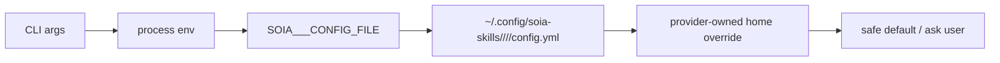

# Skill Authoring Spec

This repository publishes reusable agent skills. Every skill must work for users who do not share the maintainer's vault layout, shell profile, accounts, family context, or private files.

## Public Skill Rules

### 0. Start from the template

Create new skills from the repository template:

```bash
cp -R templates/skill-template skills/<your-skill-name>
mv skills/<your-skill-name>/SKILL.md.template skills/<your-skill-name>/SKILL.md
python3 scripts/generate_skill_catalog.py
python3 scripts/audit_skills.py
```

The template is intentionally generic: it shows config discovery, provider setup boundaries, and validation language without encoding any maintainer-specific vault layout.

`soia-open-skills` and `soia-private-skills` intentionally use the same template
path and outer structure:

```text
templates/skill-template/
├── SKILL.md.template
├── agents/openai.yaml
├── assets/
├── references/
└── scripts/
```

Do not rename this directory to `open-skill-template`. The repository name
already scopes the public/private difference, while a shared template path keeps
agent instructions and contributor commands consistent.

### Customer-readable `SKILL.md` contract

Every skill must make its first screen understandable to a customer, not only to
the maintainer. Near the top of `SKILL.md`, include a customer-readable section
that answers:

- What this skill can do.
- How the customer should use it and what inputs they must provide.
- Hard dependencies, optional dependencies, third-party skill relationships, and
  installation/setup steps.
- Where skill-specific private config belongs, using
  `~/.config/soia-skills/<repo>/<skill-type>/<skill-name>/config.yml` and
  `SOIA_<TYPE>_<SHORT>_CONFIG_FILE` when relevant.
- What logs, file changes, validation evidence, issues, and next steps the
  customer will see after every run.

Required customer-facing markers:

- `客户可读说明` or an equivalent customer-visible introduction.
- `这个技能可以做什么` / `能做什么`.
- `客户如何使用` / `如何使用` / `如何运行`.
- `依赖与安装` / `首次安装与配置` / explicit dependency section.
- `日志与完成回执` / `客户可见日志与总结` / completion receipt.

Required workflow instructions must still live in `SKILL.md`; do not hide them in
`agents/openai.yaml`, README files, or private notes.

### 1. No hardcoded personal paths

Do not hardcode maintainer-specific or vault-specific paths in scripts, `SKILL.md`, examples, or config templates.

Forbidden examples:

```text
/Users/<name>/...
~/Desktop/<personal-folder>
<personal-vault-output-dir>
<personal-vault-articles-dir>
```

Use one of these instead:

```text
<vault-relative-output-dir>
outputs/transform
$OBSIDIAN_VAULT
--vault <path>
SOIA_PKM_TRANSFORM_CONFIG=/path/to/transform.yml
~/.config/soia-skills/soia-open-skills/soia-pkm/soia-pkm-transform/config.yml
```

Chinese or highly personal directory names are allowed only in a user's private config, never as public defaults.

### 2. No secrets or account material

Never commit real keys, tokens, cookies, session strings, usernames, passwords, private `config.yml`, or `.env` files.

Allowed public examples:

```text
WECHAT_APP_ID=<YOUR_APP_ID>
WEREAD_API_KEY=<YOUR_API_KEY>
notebooklm login
```

Forbidden public examples:

```text
WECHAT_APP_SECRET=real-secret-value
WEREAD_API_KEY=real-key
TELEGRAM_SESSION_STRING=real-session
```

Provider authentication must live in the provider's private auth flow or a user-owned config file outside this repo.

### 3. Keep personal context out of public skills

Do not include private family, children, home, finances, health, addresses, phone numbers, or private learning profiles in public skills, examples, or screenshots.

If a workflow needs user preferences, model it as config:

```yaml
audience_profiles:
  - name: learner-a
    age_band: primary_school
    interests: []
```

Do not publish real names, ages, grades, schools, or private performance data.

### 4. Configuration first, not code edits

If behavior differs by user, make it configurable. Do not change code or `SKILL.md` to encode one user's needs.

Use this order:

1. CLI argument
2. Environment variable
3. Skill-specific private `config.yml`
4. Provider-owned login/config directory when the provider requires it
5. Generic safe fallback

Config templates must be generic and safe. They may show placeholders but not personal defaults.

Default private config location:

```text
~/.config/soia-skills/soia-open-skills/<skill-type>/<skill-name>/config.yml
```

The file uses YAML with an `env:` mapping. Example:

```yaml
env:
  OBSIDIAN_VAULT: "<vault-path>"
  WEREAD_API_KEY: "<YOUR_API_KEY>"
```

Skill-specific override variables should be named `SOIA_<TYPE>_<SHORT>_CONFIG_FILE`.
The older `SOIA_<TYPE>_<SHORT>_ENV_FILE` spelling may be accepted as a compatibility alias,
but new docs should prefer `CONFIG_FILE`.

Provider-owned login state may live under the skill directory only when the skill explicitly
owns that provider home. Example: `soia-pkm-transform` may set `NOTEBOOKLM_HOME` to
`~/.config/soia-skills/soia-open-skills/soia-pkm/soia-pkm-transform/notebooklm`.
Other provider-owned stores such as `~/.config/aliyunpan/` stay with the provider; the
skill config may only hold override pointers such as `ALIYUNPAN_CONFIG_DIR`.



### 5. Separate public examples from private examples

Public examples must be reusable and anonymized. If a maintainer validates with their own vault, do not copy those concrete paths or filenames into docs.

Good:

```text
转换文章为 PPT：<path-to-article.md>
归档并转成 PDF：<x-url>
```

Bad:

```text
转换 /Users/<name>/.../2026-07-07-X-real-title.md 为 PPT
```

### 6. Validate before claiming success

Use precise language:

- "static checks passed" means syntax / lint / `git diff --check` passed.
- "installed locally" means the skill was copied or linked to an agent skill directory.
- "end-to-end tested" means a realistic user request produced the requested artifact and validation checked that artifact.
- "committed" means `git commit` actually succeeded.

Do not say "tested" or "passed" without saying which checks ran.

### 7. Public skill checklist

Before commit, verify:

- [ ] `SKILL.md` has `name` and concise `description` with triggers.
- [ ] `SKILL.md` has a customer-readable intro covering capabilities, usage, dependencies/install, config, logs, and completion receipt.
- [ ] No `metadata.json`; public skills use `SKILL.md` and optional `agents/openai.yaml`.
- [ ] No maintainer-specific paths or vault directory names.
- [ ] No real secrets, cookies, tokens, sessions, private `config.yml`, or `.env` files.
- [ ] No private family/home/personal profile information.
- [ ] User-specific behavior is in config, not code.
- [ ] Examples use placeholders or generic paths.
- [ ] Scripts accept CLI args and/or env vars for paths.
- [ ] Validation commands and limits are documented.
- [ ] `git diff --check` passes.

Run the repository audit:

```bash
python3 scripts/generate_skill_catalog.py --check
python3 scripts/audit_skills.py
```

Use `--strict` in CI or before release when WARN-level drift should block:

```bash
python3 scripts/audit_skills.py --strict
```

Suggested scan:

```bash
grep -RInE '/Users/|/home/[^/<]+|WECHAT_APP_SECRET=.{8,}|WEREAD_API_KEY=.{8,}|TELEGRAM_SESSION_STRING=.{8,}|AIza[0-9A-Za-z_-]{20,}|sk-[0-9A-Za-z_-]{20,}|ghp_[0-9A-Za-z]{20,}|password *=|密码[:：]' \
  README.md CONTRIBUTING.md skills || true
```

## metadata.json

Do not add `metadata.json` to public skills. It is a legacy SOIA private catalog
format and is intentionally absent from `soia-open-skills`.

Public discovery and install use:

1. `skills/<name>/SKILL.md` frontmatter `name` and `description`
2. optional `skills/<name>/agents/openai.yaml` for UI-facing metadata
3. optional bundled `scripts/`, `references/`, and `assets/`

## Agent metadata and consumption

`SKILL.md` is the canonical cross-agent instruction file. Every agent should be
able to use a skill from `SKILL.md` alone after the skill is installed or linked
into that agent's skills directory.

`agents/openai.yaml` is optional UI/catalog metadata, not a replacement for
`SKILL.md`.

| Consumer | Uses `SKILL.md` | Uses `agents/openai.yaml` | Notes |
|---|---:|---:|---|
| Claude Code | yes | no direct runtime dependency | Claude Code discovers installed skills from `~/.claude/skills/<name>/SKILL.md`; keep all required instructions in `SKILL.md`. |
| Codex / OpenAI-style surfaces | yes | optional | `agents/openai.yaml` provides display name, short description, and default prompt for friendlier UI/catalog text. |
| SOIA runtime / registry | yes | optional via generator | Use `python3 scripts/generate_skill_catalog.py --registry-out <soia-repo>/runtime/registry/skills`; the generator merges `SKILL.md` with optional `agents/openai.yaml`. |
| Other skills.sh-compatible agents | yes | no assumption | Treat `SKILL.md` as the portable contract. Do not rely on agent-specific yaml unless that agent explicitly documents support. |

Rules:

- Never put required workflow steps only in `agents/openai.yaml`; duplicate them in `SKILL.md`.
- If `agents/openai.yaml` exists, keep it short and customer-facing: `display_name`, `short_description`, `default_prompt`.
- If another agent later needs its own metadata, add a separate `agents/<agent>.yaml` only when there is a real consumer and document that consumer here.
- Regenerate catalog/registry after changing `SKILL.md` or `agents/openai.yaml`.

`skills/README.md` is generated from the same sources:

```bash
python3 scripts/generate_skill_catalog.py
```

When v7 SOIA needs machine-readable registry manifests, export them from the same
source fields instead of adding `metadata.json`:

```bash
python3 scripts/generate_skill_catalog.py --registry-out <soia-repo>/runtime/registry/skills
```
