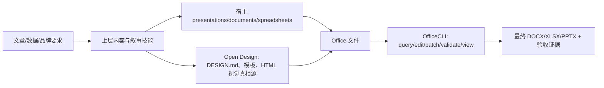

# Office Tool Routing

## 核心判断

OfficeCLI 是 Office 文件操作层，不是通用设计引擎。先服从当前宿主的文档技能硬约束，再根据任务选择执行层。

| 任务 | 首选 | OfficeCLI 的角色 | 不应误用 |
|---|---|---|---|
| 从零设计高质量 PPT | 宿主 presentations；已有设计系统时可用 Open Design | 生成后查询、精确修改、schema/issues/截图复验 | 用大量低级 shape 命令代替视觉设计 |
| 基于 Open Design 的高保真 deck | `soia-dev-open-design-ops` | 检查导出 PPTX、修小范围 OOXML 问题 | 把截图型 PPTX 称为可编辑母版 |
| 修改已有 PPTX | OfficeCLI | stable ID 查询、DOM 修改、batch、watch | 未读取路径就按位置猜 shape |
| 创建/修改 DOCX | 宿主 documents 或 OfficeCLI | 通用结构编辑、评论/修订、schema 与预览 | 替代宿主已有的隐私、无障碍或专用 redline 工具而不复验 |
| 创建/修改 XLSX | 宿主 spreadsheets 或 OfficeCLI | 单元格、公式、图表、透视表和结构审计 | 只验证 schema，不验证公式与计算结果 |
| 跨宿主统一 Office 自动化 | OfficeCLI CLI/MCP | 一个命令模型覆盖 DOCX/XLSX/PPTX | 自动注册 MCP 或覆盖用户配置 |

## 当前 Codex runtime 事实

- Presentations：以 JavaScript ES modules 和 `@oai/artifact-tool` 创作；明确禁止 `python-pptx`。Python 只用于渲染、montage 和 QA 辅助。
- Spreadsheets：以 JavaScript 和 `@oai/artifact-tool` 创作；默认不使用 `openpyxl`、`xlsxwriter` 或 `pandas.ExcelWriter`。
- Documents：当前主要使用 Python `python-docx` 和 OOXML helper，配合 LibreOffice/render scripts 做视觉 QA。
- OfficeCLI：上游本体是 C#/.NET 10，基于 `DocumentFormat.OpenXml`，发布为 self-contained single-file binary。

这些事实说明“Office 底层都是 Python”不成立。正确结构是多执行层：上层技能定义内容与验收，宿主工具负责创作，OfficeCLI 提供跨格式的结构化操作和复验。

## Open Design 与 OfficeCLI

Open Design 决定“长什么样、如何沿用设计系统”；OfficeCLI 决定“文件里有什么、如何稳定修改、是否通过结构和预览检查”。两者可以串联，不应二选一。
