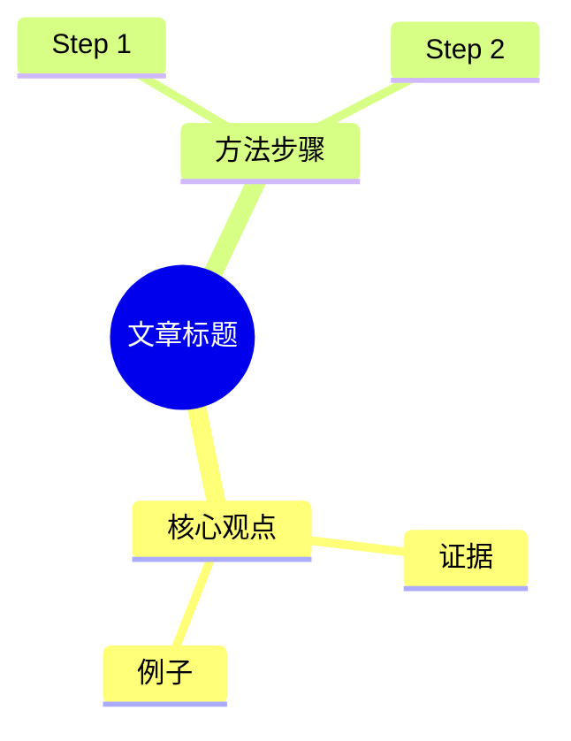

# Output Recipes

按目标产物读取对应小节。所有 recipe 都从标准 article packet 开始，不直接操作原 URL。

## PDF

默认：vault 内 Markdown -> Obsidian 原生导出。

步骤：

1. 确认源文件在 Obsidian vault 内。
2. 使用 Obsidian 自带「导出 PDF」或等价自动化。
3. 保存到源 Markdown 同目录同名 stem。
4. 检查 PDF 存在、页数合理、中文不乱码。
5. 回写 `## 转化产物` 链接。

降级：

- 源不在 vault：使用 agent PDF 能力生成。
- Obsidian 不可用：告知降级，并用程序化 PDF 或浏览器打印。

## PPT / PPTX

默认分两种：

- 需要可编辑、本地交付：用当前 agent 的 presentation provider。
- 需要快速 grounded deck 或多源资料：用 NotebookLM `slide-deck`，优先下载 `.pptx`，不行再下载 PDF。

内容结构：

1. 题名页：文章标题、来源、作者。
2. 3-5 个核心观点或章节。
3. 关键证据 / 案例。
4. 行动建议 / 讨论问题。
5. 来源页。

验证：

- PPTX 能打开。
- 渲染预览全部页。
- 无明显文字重叠、越界、空白页。

## 图片 / 长图 / 信息图

默认：

- 单张视觉说明图：image provider。
- 长图/信息图：优先 HTML/CSS 排版后截图；需要 AI 设计风格时用 image provider。
- NotebookLM 可用且用户要「信息图」时，可选 `generate infographic`。

要求：

- 先从文章提取 1 个主题、3-7 个信息块、目标读者。
- 中文密集内容优先用 HTML 截图，避免生图文字不稳定。
- 生成图要保存为 PNG。

验证：

- 图片存在、尺寸合理。
- 文字在目标尺寸下可读。
- 不出现明显乱码、截断、错别字。

## Quiz / Exam

默认：

- NotebookLM 可用：`generate quiz`，下载 Markdown 或 JSON。
- 本地降级：生成 `quiz.md`。

题型建议：

- 选择题 5-10 道。
- 简答题 3-5 道。
- 应用题 / 讨论题 1-3 道。
- 单独 `## 答案与解析`，不要把答案混在题目后。

验证：

- 题目编号连续。
- 每道选择题有且只有一个标准答案，除非明确是多选。
- 答案区题号与题目区一致。
- 不编造原文没有的事实。

## Mindmap

默认：

- NotebookLM 可用：`generate mind-map`，下载 JSON。
- 本地降级：生成 Mermaid mindmap 或缩进 Markdown。
- 用户要演示效果：可接 mindmap-ppt 类 provider 或当前 agent presentation provider。

本地 Mermaid 形态：

验证：

- 层级不超过 4 层，避免过密。
- 每个节点短句化。
- Mermaid 代码块语法完整。

## Podcast / Audio

默认：NotebookLM `generate audio`。

要求：

- 说明语言、时长和风格。
- 等待完成后下载 MP3。
- 回执里标注 NotebookLM 生成，不说成本地音频模型。

不可用时：

- 不伪造音频。可以先生成播客脚本 Markdown，等待用户配置 provider。

## Flashcards

默认：

- NotebookLM `generate flashcards` 下载 Markdown/JSON。
- 本地降级：生成问答卡 Markdown 表格。

验证：

- 每张卡只考一个点。
- 正面是问题，背面是答案和必要解释。
- 避免过长答案。

## Report

默认：

- NotebookLM `generate report` 适合 grounded 资料报告。
- 本地 Markdown report 适合快速总结和轻量加工。
- 如果用户要原创文章而不是报告，转交 `soia-pkm-compose`。

结构：

1. 摘要。
2. 核心观点。
3. 关键证据。
4. 可执行建议。
5. 局限与待核实。
6. 来源。

## WeChat / X / Xiaohongshu

直接转交 `soia-pkm-publish`：

- 公众号：Markdown -> WeChat-ready HTML / 草稿箱。
- X：thread 拆条。
- 小红书：卡片式文案 + 配图建议。

发布链路必须遵守人工闸门：公众号只建草稿，不自动群发。
