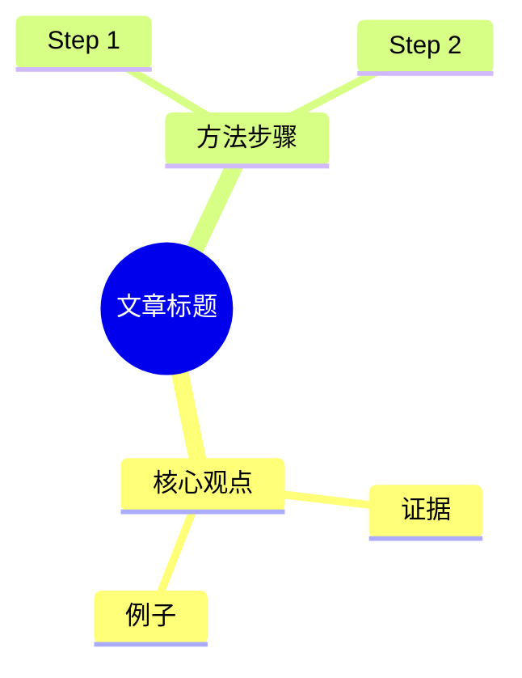

# Output Recipes

按目标产物读取对应小节。所有 recipe 都从标准 article packet 开始，不直接操作原 URL。

## PDF

默认：vault 内 Markdown -> Obsidian 原生导出，内容模式为 `preserve`。

PDF 的默认语义是**全文转换**，不是摘要报告。除非用户明确说「总结成 PDF」或「briefing PDF」，不得把一篇长文压缩成几页观点。

步骤：

1. 确认源文件在 Obsidian vault 内。
2. 使用 Obsidian 自带「导出 PDF」或等价自动化，保留标题、frontmatter 可读信息、正文层级、引用、图片和链接。
3. 保存到源 Markdown 同目录同名 stem；如果生成派生版，文件名明确标注 `full` / `summary` / `report`。
4. 检查 PDF 存在、页数合理、中文不乱码；页数应与原文长度大致匹配，不能明显少到只剩摘要。
5. 回写 `## 转化产物` 链接。

降级：

- 源不在 vault：使用 agent PDF 能力生成。
- Obsidian 不可用：告知降级，并用程序化 PDF 或浏览器打印生成全文版；如果只能生成摘要，必须先说明并征求确认。

## PPT / PPTX

开始前先读取 [design-prompts.md](design-prompts.md) 的「PPT / 课件 Prompt」和 QA Gate。PPT 的失败形态通常不是文件打不开，而是低密度、无叙事、每页重复卡片、看起来像自动摘要。

默认分两种：

- 需要高质量视觉和 HTML/PPT 双交付：优先用 Open Design / html-ppt 模板。
- 需要可编辑、本地交付：用当前 agent 的 presentation provider。
- 需要快速 grounded deck 或多源资料：用 NotebookLM `slide-deck`，优先下载 `.pptx`，不行再下载 PDF。

选型：

- 教学/概念入门：`course-module` 或 `presenter-mode-reveal`。
- 系统结构/术语关系/工作流：`knowledge-arch-blueprint`。
- 技术分享：`tech-sharing`。
- AI 工具/知识图谱/流程：`graphify-dark-graph`。
- 小红书图文：`xhs-white-editorial` 或 `xhs-post`。

内容结构至少 8-12 页，除非用户要求短 deck：

1. 题名页：文章标题、来源、作者。
2. 文章地图：保留原文主要章节，不只列 3-5 个观点。
3. 案例/任务拆解。
4. 概念层级和关键辨析。
5. 流程 / 架构 / 关系图。
6. 术语速查或表格。
7. 行动建议 / 讨论问题 / 自测。
8. 来源页。

验证：

- PPTX 能打开。
- 渲染预览全部页。
- 无明显文字重叠、越界、空白页。
- 版式轮廓至少包含 4 种：封面 / 地图 / 流程 / 对比 / 表格 / 自测 / 来源，不能每页同一种卡片模板。
- 若使用 HTML deck，必须保留键盘导航和导出路径；不要只交一个不可编辑截图。

## 图片 / 长图 / 信息图

开始前先读取 [design-prompts.md](design-prompts.md) 的「高密度信息图 Prompt」和 QA Gate。信息图必须先做信息架构，再做视觉；不要从「帮我总结」直接跳到 HTML。

默认：

- 高密度中文长图/信息图：优先 Open Design / HTML/CSS 排版后用 managed Chromium 截图。
- 单张视觉说明图：image provider。
- NotebookLM 可用且用户要「信息图」时，可选 `generate infographic`。

要求：

- 先从文章提取 1 个主题、8-15 个信息块、目标读者、关键关系、风险/边界/结论。
- 中文密集内容优先用 HTML 截图，避免生图文字不稳定。
- 参考结构：顶部 verdict / 一句话结论；中部 6-9 张编号卡片；下部流程图、对比表、趋势/关系图；底部支持点、风险点、继续追问。
- 信息密度优先于装饰，避免空洞大标题、低信息量渐变卡、单色大留白。
- 生成图要保存为 PNG。

验证：

- 图片存在、尺寸合理。
- 文字在目标尺寸下可读。
- 不出现明显乱码、截断、错别字。
- 至少人工或截图抽查一次，不得只检查文件存在。
- 抽查时若出现遮挡、过度留白、信息块不足、层级不清，必须迭代版式后再交付。

## Quiz / Exam

默认：

- NotebookLM 可用：`generate quiz`，下载 Markdown 或 JSON。
- 本地降级：生成 `quiz.md`。

题型建议：

- 选择题 5-10 道。
- 简答题 3-5 道。
- 应用题 / 讨论题 1-3 道。
- 单独 `## 答案与解析`，不要把答案混在题目后。

验证：

- 题目编号连续。
- 每道选择题有且只有一个标准答案，除非明确是多选。
- 答案区题号与题目区一致。
- 不编造原文没有的事实。

## Mindmap

默认：

- NotebookLM 可用：`generate mind-map`，下载 JSON。
- 本地降级：生成 Mermaid mindmap 或缩进 Markdown。
- 用户要演示效果：可接 mindmap-ppt 类 provider 或当前 agent presentation provider。

本地 Mermaid 形态：

验证：

- 层级不超过 4 层，避免过密。
- 每个节点短句化。
- Mermaid 代码块语法完整。

## Podcast / Audio

默认：NotebookLM `generate audio`。

要求：

- 说明语言、时长和风格。
- 等待完成后下载 MP3。
- 回执里标注 NotebookLM 生成，不说成本地音频模型。

不可用时：

- 不伪造音频。可以先生成播客脚本 Markdown，等待用户配置 provider。

## Flashcards

默认：

- NotebookLM `generate flashcards` 下载 Markdown/JSON。
- 本地降级：生成问答卡 Markdown 表格。

验证：

- 每张卡只考一个点。
- 正面是问题，背面是答案和必要解释。
- 避免过长答案。

## Report

默认：

- NotebookLM `generate report` 适合 grounded 资料报告。
- 本地 Markdown report 适合快速总结和轻量加工。
- 如果用户要原创文章而不是报告，转交 `soia-pkm-compose`。

注意：Report 是「综合报告」，不是 PDF 全文导出。用户说「转 PDF」时不要自动转成 report。

结构：

1. 摘要。
2. 核心观点。
3. 关键证据。
4. 可执行建议。
5. 局限与待核实。
6. 来源。

## WeChat / X / Xiaohongshu

直接转交 `soia-pkm-publish`：

- 公众号：Markdown -> WeChat-ready HTML / 草稿箱。
- X：thread 拆条。
- 小红书：卡片式文案 + 配图建议。

发布链路必须遵守人工闸门：公众号只建草稿，不自动群发。
